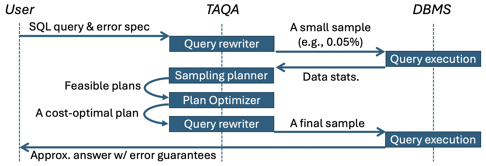
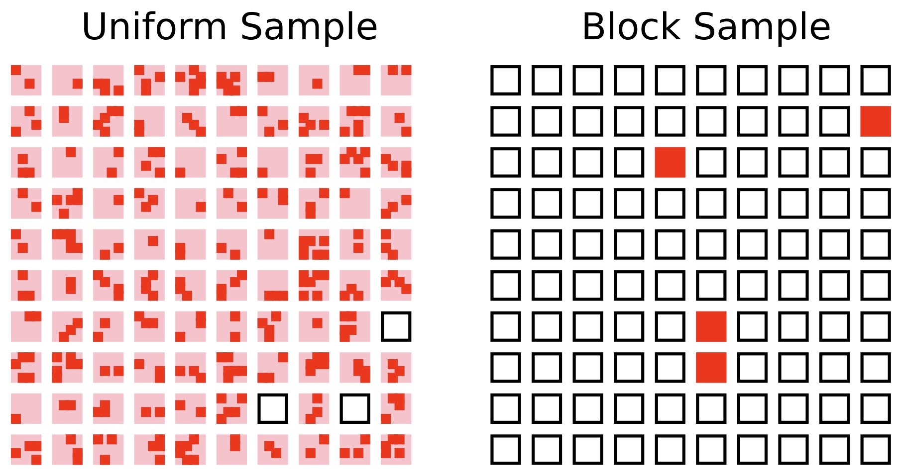

# PilotDB: Database-Agnostic Online Approximate Query Processing with A Priori Error Guarantees

This repository contains the code for PilotDB, an online middleware approximate 
query processing system that
1. provides *user-specified* error guarantees (i.e., a priori error guarantees)
2. requires no offline maintenance
3. requires no modifications to the underlying database management system
4. achieves up to 126x speedups

To achieve these features, we develop the following features in PilotDB:
1. **TAQA**: the two-stage query approximation middleware
    <p align="center">
        
    </p>
3. **BSAP**: efficient block sampling for approximate queries with statistical guarantees
    <p align="center">
        
    </p>

---

## 🔥 Getting Started

> [!WARNING]
> We recommend running on an `x86_64` or `amd64` machine.

### 🚀 Quick Setup via Docker

You will need to have the [docker engine](https://docs.docker.com/engine/install/) installed in your machine.

1. `cp dockerfile .env.example .env` and set your own environment variables.
2. Build images and start containers:
    ```bash
    cd dockerfile
    docker compose up --build
    ```
3. Test connections 
    ```bash
    curl http://localhost:8080/test_postgres_connection
    curl http://localhost:8080/test_sqlserver_connection
    curl http://localhost:8080/test_duckdb_connection
    ```

To use PilotDB, you will need to
1. Populate the database with any data you like
2. Prepare a `yaml` file with database configurations and credentials. See examples in `db_configs`. 
3. Execute an approximate query by running `pilotdb_client.py` as follows:
    ```bash
    python pilotdb_client.py \
        --aqp \
        --query_file path/to/sql/file.sql \
        --db_config_file path/to/db/config/file.yml \
        --error 0.05 \
        --probability 0.05
    ```
    where `--error` and `--probability` specify the error rate and failure probability for a priori error guarantees.

### 🌰 Example

We use an example to show the power of PilotDB. To run this example, you will need at least 265 GB disk space.

1. Download pre-generated DuckDB database for TPC-H 1TB.
    ```bash
    wget https://blobs.duckdb.org/data/tpch-sf1000.db $DUCKDB_DATA
    ```
2. Start containers and test connection
    ```bash
    cd dockerfile
    docker compose.yml up
    curl http://localhost:8080/test_duckdb_connection
    ```
3. Run queries and compare latency
    ```bash
    python pilotdb_client.py --mode aqp --query_file example/tpch-6.sql --db_config_file example/duckdb_config.yml --error 0.05 --probability 0.05
    python pilotdb_client.py --mode exact --query_file example/tpch-6.sql --db_config_file example/duckdb_config.yml --error 0.05 --probability 0.05
    ```

### 🧪 Local Setup (Recommended for Benchmark Evaluation)

To set up PilotDB locally, make sure you have the following tools installed, which might require `root` permissions.
1. [uv](https://docs.astral.sh/uv/getting-started/installation/)
2. [Microsoft ODBC](https://learn.microsoft.com/en-us/sql/connect/odbc/linux-mac/installing-the-microsoft-odbc-driver-for-sql-server?view=sql-server-ver15&tabs=alpine18-install%2Calpine17-install%2Cdebian8-install%2Credhat7-13-install%2Crhel7-offline) for SQL Server 2022
3. [PostgreSQL](https://www.postgresql.org/download/linux/ubuntu/)

Install python packages:
```bash
uv sync
uv pip install -e .
```

Prepare db config files using the template in `db_configs`. Then, you can run PilotDB as a python package
```python
import pilotdb
db_config = {
    "dbms": "postgres", # or duckdb, sqlserver
    "username": "tester",
    "dbname": "testdb",
    "host": "hostname",
    "port": "dbport",
    "password": "password"
}
conn = pilotdb.connect("postgres", db_config)
result = pilotdb.run(
    conn,
    query="SELECT AVG(x) FROM T",
    error=0.05,
    probability=0.05 # the failure probability
)
pilotdb.close(conn)
```

or via the `evaluate.py` scrip. For example,
```bash
python evaluate.py \
    --benchmark tpch \
    --qid 1 \
    --dbms postgres \
    --db_config_file db_configs/postgres.yml \
    --process_mode aqp \
    --error 0.05 \
    --failure_probability 0.05
```

## 📐 Reproduce Results

You can follow the procedures below to reproduce the experimental results in
our paper.

### Set Up Benchmarks

You need to set up the underlying database manage system with data loaded.
1. Make sure PostgreSQL and SQL Server are installed

2. Generate data for benchmarks

    - [TPC-H](https://www.tpc.org/tpc_documents_current_versions/current_specifications5.asp): 
    The official TPC-H toolkit.

    - [SSB](https://github.com/electrum/ssb-dbgen): We use the community version of
    the data generation script since the original SSB dataset is not open-sourced.
    We double-checked the correctness of those scripts.

    - [ClickBench](https://github.com/ClickHouse/ClickBench/): The official GitHub
    repo of ClickBench by ClickHouse.

    - [Instacart](https://www.kaggle.com/c/instacart-market-basket-analysis/data):
    The official Instacart data released in Kaggle.

    - [DSB](https://github.com/microsoft/dsb/tree/main): The official GitHub repo
    of DSB by Microsoft.

### Run Experiment Scripts

Based on the experiment you want to reproduce, you can run the 
corresponding script in the folder `experiments`.

1. To run the experiments of the quey speedups on various DBMSs and workloads 
(Section 5.3), you can execute the bash scripts 
`experiments/query_speedups/run_pilotdb_<benchmark>.sh`, where `<benchmark>` 
$\in$ `{tpch,ssb,clickbench,instacart}`.

2. To run the experiments of the quey speedups on skewed data distribution 
(Section 5.3), you can execute the bash scripts
`experiments/query_speedups/run_pilotdb_dsb.sh`.

3. To run the experiments of the query speedups under different target errors
(Section 5.3), you can execute the bash script 
`experiments/query_speedups/run_pilotdb_varying_errors.sh`

4. To run the experiments of ablation study (Section 5.5), you can execute the 
bash scripts `experiments/ablation/run_pilotdb_<config>.sh`, where `<config>` 
$\in$ `{oracle,uniform}`.

5. To run the experiments of PilotDB without BSAP (Supplementary Material B.1), 
you can execute the bash script `experiments/error_guarantees/run_pilotdb_nobsap.sh`.


6. To run the sensitivity experiments (Supplementary Material B.2),
you can execute the bash scripts `experiments/sensitivity/run_sensitivity_<knob>.sh`,
where `<knob>` $\in$ `{pilot-rate,selectivity}`.

7. To reproduce the Figure 4, you can execute the bash script 
`experiments/others/sampling_method_system_efficiency/run.sh`.

8. To reproduce the failure example in Section 4.3, you can execute the python
script `others/standard_clt_coverage_example/run_duckdb.py`.

## Citation
```bibtex
@article{zhu2025pilotdb,
  title={PilotDB: Database-Agnostic Online Approximate Query Processing with A Priori Error Guarantees},
  author={Zhu, Yuxuan and Jin, Tengjun and Baziotis, Stefanos and Zhang, Chengsong and Mendis, Charith and Kang, Daniel},
  journal={Proceedings of the ACM on Management of Data},
  volume={3},
  number={3},
  pages={1--28},
  year={2025},
  publisher={ACM New York, NY, USA}
}
```
