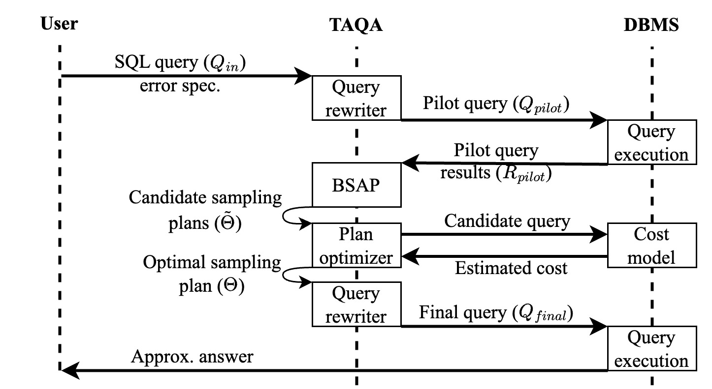
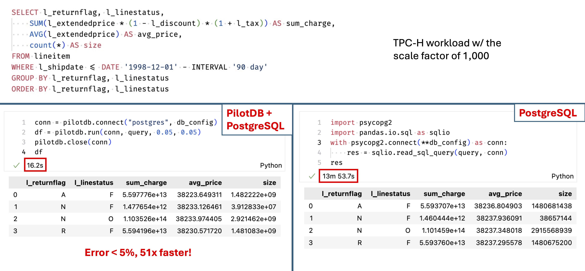

# PilotDB

An online middleware approximate query processing system that
1. provide user-specified error guarantees (i.e., a priori error guarantees)
2. requires no maintenance
3. requires no modifications to the underlying database management system
4. achieves up to 126x speedups

<p float="middle">
    
</p>

## Setup

Install conda environment, DBMSs, and python packages

```batch
source install.sh
```

Install PilotDB as a Python package
```batch
pip install -e .
```

Setup the database configuration in `db_configs/<dbms_bench>.yml`

## Interface and Demo
We provide a Python interface to PilotDB.
```python
import pilotdb
db_config = {
    "dbms": "postgres", # or duckdb, sqlserver
    "username": "tester",
    "dbname": "testdb",
    "host": "hostname",
    "port": "dbport",
    "password": "password"
}
conn = pilotdb.connect("postgres", db_config)
result = pilotdb.run(
    conn,
    query="SELECT AVG(x) FROM T",
    error=0.05,
    probability=0.05 # the failure probability
)
pilotdb.close(conn)
```

The following demo shows the a priori error guarantees and query acceleration of PilotDB.
<p float="middle">
    
</p>

## Experiments
We provide a set of scripts to replicate the experiments in our paper conveniently.

To approximately execute TPC-H, Clickhouse, SSB or Instacart queries
```batch
python run_pilotdb.py \
    --benchmark <tpch|clickhouse|ssb|instacart> \
    --qid <query_id> \
    --pilot_sample_rate 0.05 \
    --dbms <postgres|duckdb|sql_server> \
    --db_config_file <path_to_db_config> \
    --process_mode aqp \
    --error <error_target>
```

To execute queries of oracle experiments
```batch
python run_pilotdb.py \
    --benchmark <tpch|clickhouse|ssb|instacart> \
    --qid <query_id> \
    --dbms <postgres|duckdb|sql_server> \
    --db_config_file <path_to_db_config> \
    --process_mode oracle \
    --error <error_target>
```


To approximately execute queries by uniform sampling
```batch
python run_pilotdb.py \
    --benchmark <tpch|clickhouse|ssb|instacart> \
    --qid <query_id> \
    --dbms <postgres|duckdb|sql_server> \
    --db_config_file <path_to_db_config> \
    --process_mode uniform \
    --error <error_target>
```

To execute final sampling queries only, you need to add sample rates in sample_rate.json, then run
```batch
python run_pilotdb.py \
    --benchmark <tpch|clickhouse|ssb|instacart> \
    --qid <query_id> \
    --dbms <postgres|duckdb|sql_server> \
    --db_config_file <path_to_db_config> \
    --process_mode sample 
```

To exactly execute TPC-H query 1 on postgres
```batch
python run_pilotdb.py \
    --benchmark <tpch|clickhouse|ssb|instacart> \
    --qid <query_id> \
    --dbms <postgres|duckdb|sql_server> \
    --db_config_file <path_to_db_config> \
    --process_model exact
```
