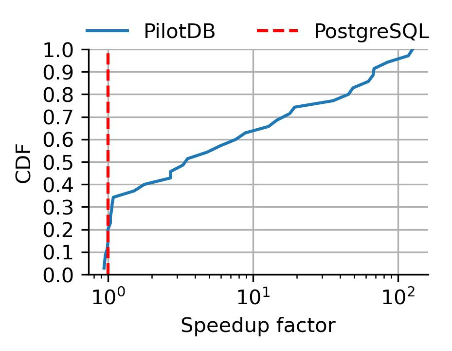
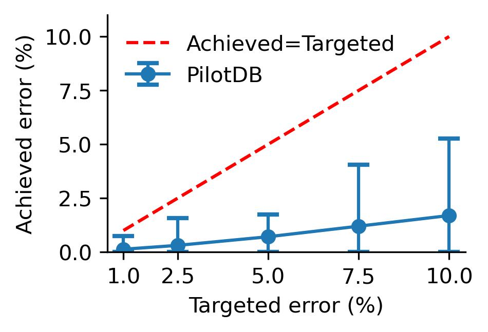
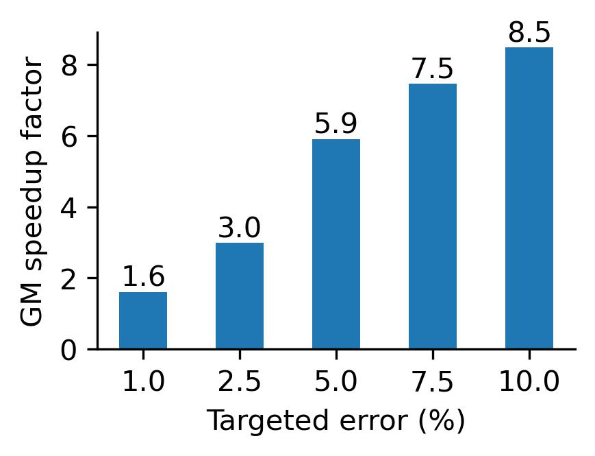

# PilotDB

An online approximate query processing framework providing a priori error guarantees and up to 126$\times$ latency reduction.

<p float="middle">
    
    <em>Workflow of PilotDB</em>
</p>

## Setup

Install conda environment, DBMSs, and python packages

```batch
source install.sh
```

Install PilotDB as a python package
```batch
pip install -e .
```

Setup the database configuration in `db_configs/<dbms_bench>.yml`

## Experiments
To approximately execute TPC-H, Clickhouse, SSB or Instacart queries
```batch
python run_pilotdb.py \
    --benchmark <tpch|clickhouse|ssb|instacart> \
    --qid <query_id> \
    --pilot_sample_rate 0.05 \
    --dbms <postgres|duckdb|sql_server> \
    --db_config_file <path_to_db_config> \
    --process_mode aqp \
    --error <error_target>
```

To execute queries of oracle experiments
```batch
python run_pilotdb.py \
    --benchmark <tpch|clickhouse|ssb|instacart> \
    --qid <query_id> \
    --dbms <postgres|duckdb|sql_server> \
    --db_config_file <path_to_db_config> \
    --process_mode oracle \
    --error <error_target>
```


To approximately execute queries by uniform sampling
```batch
python run_pilotdb.py \
    --benchmark <tpch|clickhouse|ssb|instacart> \
    --qid <query_id> \
    --dbms <postgres|duckdb|sql_server> \
    --db_config_file <path_to_db_config> \
    --process_mode uniform \
    --error <error_target>
```

To execute final sampling queries only, you need to add sample rates in sample_rate.json, then run
```batch
python run_pilotdb.py \
    --benchmark <tpch|clickhouse|ssb|instacart> \
    --qid <query_id> \
    --dbms <postgres|duckdb|sql_server> \
    --db_config_file <path_to_db_config> \
    --process_mode sample 
```

To exactly execute TPC-H query 1 on postgres
```batch
python run_pilotdb.py \
    --benchmark <tpch|clickhouse|ssb|instacart> \
    --qid <query_id> \
    --dbms <postgres|duckdb|sql_server> \
    --db_config_file <path_to_db_config> \
    --process_model exact
```

## Evaluation
<p float="middle">
    
    
    
</p>